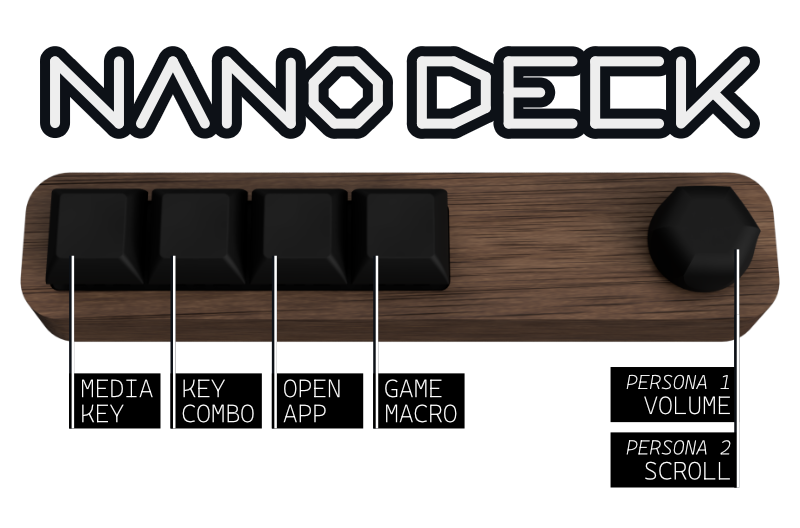
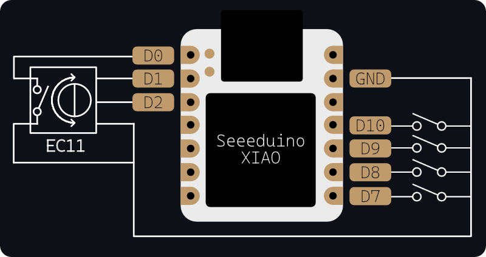

# NANO DECK - Macro Pad

The simple Macro Pad with Encoder. Utilising the Seeeduino XIAO with CircuitPython for easy on-the-fly modification.

## Key Features
* 5 Key + Encoder
* CircuitPython
* Seeeduino XIAO development board
* 3D Printed Components

## Bill of Materials
| Quantity | Part |
| --- | --- |
| 1 | [Seeeduino XIAO](https://wiki.seeedstudio.com/Seeeduino-XIAO/) |
| 4 | Cherry-type Mechnical Switch |
| 1 | EC11 Rotary Encoder |
| 1 | [3D Printed Base](parts/Base.3mf) |
| 1 | [3D Printed Plate](parts/Plate.3mf) |
| 1 | [CNC milled or 3D Printed Shell](parts/Shell.3mf) |

## Assembly
***Parts may need to be rotated from their orientation in the 3MF file to suit your fabrication choice***
1. Print the Base and Plate
2. Print or Mill the Shell
3. Pushfit the switches into the top of the Plate
4. Pushfit the Plate into the bottom of the shell
5. Pushfit the Seeduino XIAO into the bottom of the Plate

## Wiring

| Board Pin | Interface |
| --- | --- |
| D0 | Rotary Encoder Switch |
| D1 | Rotary Encoder A |
| D2 | Rotary Encoder B |
| D7 | Switch 1 |
| D8 | Switch 2 |
| D9 | Switch 3 |
| D10 | Switch 4 |

## Code
1. Install CircuitPython using the guide at SeeedStudio https://wiki.seeedstudio.com/Seeeduino-XIAO-CircuitPython
2. Copy the [code.py](code.py) file to the CIRCUITPY volume and modify to fit your needs
